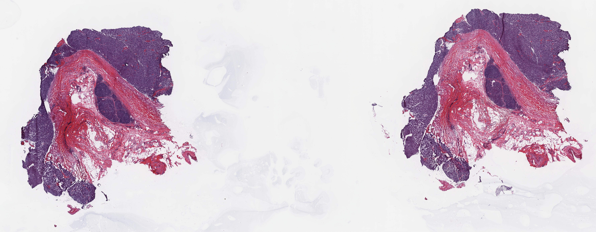

# imaging
## Setup
Currently, the [nx application from NoMachine](https://www.nomachine.com/) is not working. See Biowulf instructions [here](https://hpc.nih.gov/docs/connect.html). To get around this and visually inspect images remotely, follow these steps:

1. Install XQuartz for mac (https://www.xquartz.org/), logout and log back into NIH laptop, then use the -Y flag when connecting via ssh to Biowulf. 
2. Install [conda](https://hpc.nih.gov/apps/python.html#envs) with settings storing envs on your biowulf /data folder so that large custom packages packages can be installed without root. 
3. Install libvips 

```bash
conda install -c conda-forge libvips
```

4. Load conda env from your /data folder. Consider adding this to your bash_rc file so that you can use conda everytime you logon to an interactive session, otherwise run this command each time that you log on. 

```bash
source /data/$USER/conda/etc/profile.d/conda.sh
```

## Pilot Data
A dataset of [Breast Metastases to Axillary Lymph Nodes](https://wiki.cancerimagingarchive.net/display/Public/Breast+Metastases+to+Axillary+Lymph+Nodes) is being used for the initial pilot. 
GDC H&E data can be downloaded using gdc command line tools and a manifest generated on the [GDC Website](https://portal.gdc.cancer.gov/):
   
```bash 
module load gdc-client/1.5.0
gdc-client download -m  /home/luberjm/gdc_manifest_20201105_184746.txt
```

The manifest is also included in the docs folder.

## Fast Conversion of SVS to JPG 
The subdirectory structure is annoying from the gdc-client output, so we will first fix that.

```bash
mv */*.svs .
rm -R -- */
ls * > images.txt
```

sbatch --export=F='filename.svs' svs_conversion.sbatch

## Viewing Data
Fiji

Now, we will convert everything to JPG. Note that libvips has really efficient C integrations with OpenSlide, and that we can set a level "flag" to determine the resolution of our output. Here we set a level that gives us images that are 1000sx1000s of pixels, which is a sweet spot for processing as each image takes a few seconds. This may be modified later. The conversion script is located in scripts.

Convert 1 image

```bash 
sbatch --export=F='TCGA-XM-A8RC-01A-01-TSA.E8BB705F-15D0-41F3-8A37-1F25964A5BBB.svs' svs.conversion.sbatch
```

## Examples of Slides That Will Be Challenging For Autoencoder
This is an ongoing list of challenging training examples that we will have to account for via preprocessing. 

